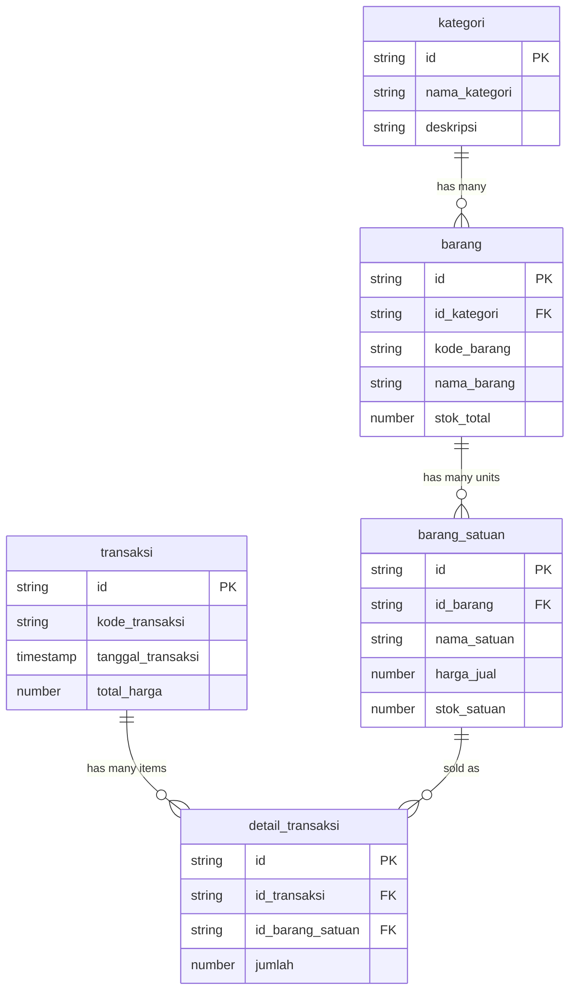

# 🏪 Toko Kelontong - Database Structure

## 📋 Overview
Aplikasi inventory management untuk toko kelontong dengan sistem relasi database Firestore yang terstruktur.

## 🗂️ Firestore Collections Structure

### 📁 Collection: `kategori`
Menyimpan data kategori barang.

**Fields:**
- `nama_kategori` : string (required)
- `deskripsi` : string (nullable)

**Example:**
```json
{
  "nama_kategori": "Makanan Ringan",
  "deskripsi": "Berbagai jenis snack dan camilan"
}
```

### 📁 Collection: `barang`
Menyimpan data barang utama.

**Fields:**
- `id_kategori` : string (Document ID dari koleksi kategori)
- `kode_barang` : string (auto-generated, format: [KAT]001)
- `nama_barang` : string
- `stok_total` : number (calculated from all barang_satuan)

**Example:**
```json
{
  "id_kategori": "kategori_doc_id_123",
  "kode_barang": "MAK001",
  "nama_barang": "Indomie Goreng",
  "stok_total": 120
}
```

### 📁 Collection: `barang_satuan`
Menyimpan data satuan dan harga barang (one-to-many dengan barang).

**Fields:**
- `id_barang` : string (Document ID dari koleksi barang)
- `nama_satuan` : string (Pcs, Box, Karton, dll)
- `harga_jual` : number
- `stok_satuan` : number

**Example:**
```json
{
  "id_barang": "barang_doc_id_456",
  "nama_satuan": "Pcs",
  "harga_jual": 3000,
  "stok_satuan": 50
}
```

### 📁 Collection: `transaksi`
Menyimpan header transaksi.

**Fields:**
- `kode_transaksi` : string (auto-generated, format: TRX[YYYYMMDD]001)
- `tanggal_transaksi` : timestamp
- `total_harga` : number (calculated from detail_transaksi)

**Example:**
```json
{
  "kode_transaksi": "TRX20231016001",
  "tanggal_transaksi": "2023-10-16T10:30:00Z",
  "total_harga": 25000
}
```

### 📁 Collection: `detail_transaksi`
Menyimpan detail item transaksi (one-to-many dengan transaksi).

**Fields:**
- `id_transaksi` : string (Document ID dari koleksi transaksi)
- `id_barang_satuan` : string (Document ID dari koleksi barang_satuan)
- `jumlah` : number

**Example:**
```json
{
  "id_transaksi": "transaksi_doc_id_789",
  "id_barang_satuan": "barang_satuan_doc_id_101",
  "jumlah": 5
}
```

## 🔗 Database Relations



## 🔄 Data Flow

### 1. Setup Data
1. **Kategori** → Buat kategori barang
2. **Barang** → Tambah barang dengan referensi kategori
3. **Barang Satuan** → Tambah satuan untuk setiap barang (Pcs, Box, dll)

### 2. Transaction Flow
1. **Pilih Barang** → Dari daftar barang tersedia
2. **Pilih Satuan** → Pilih satuan dan jumlah
3. **Proses Transaksi** → Sistem otomatis:
   - Generate kode transaksi
   - Buat dokumen transaksi
   - Buat detail transaksi untuk setiap item
   - Update stok barang_satuan
   - Hitung total harga

### 3. Query Examples

#### Get complete product info with category and units:
```dart
// Get barang with kategori
final barang = await FirestoreService.getBarangById(barangId);
final kategori = await FirestoreService.getKategoriById(barang.idKategori);

// Get all units for this barang
final units = await FirestoreService.getBarangSatuanByBarangStream(barangId);
```

#### Get complete transaction data:
```dart
final transactionData = await FirestoreService.getCompleteTransactionData(transactionId);
// Returns: { transaksi, details: [{ detail, barangSatuan, barang, kategori, subtotal }] }
```

## 🛠️ Key Features

### ✅ Implemented Features
- **Home Dashboard** - Overview statistik dan navigasi utama
- **Kategori CRUD** - Kelola kategori dengan deskripsi
- **Barang CRUD** - Kelola barang dengan relasi kategori
- **Satuan Management** - Kelola multiple satuan per barang
- **Transaction System** - Sistem transaksi lengkap dengan keranjang
- **Transaction History** - Riwayat dan detail transaksi
- **Stock Management** - Auto update stok saat transaksi
- **Search & Filter** - Pencarian dan filter di semua modul

### 🔧 Auto-Generated Codes
- **Kode Barang**: Format `[3-HURUF-KATEGORI][3-DIGIT-URUT]` (contoh: MAK001)
- **Kode Transaksi**: Format `TRX[YYYYMMDD][3-DIGIT-URUT]` (contoh: TRX20231016001)

### 📱 Screens Architecture
```
├── screens/
│   ├── home_screen.dart              # Dashboard utama dengan statistik
│   ├── kategori_screen.dart          # CRUD kategori
│   ├── barang_screen.dart            # CRUD barang + navigasi ke units
│   ├── manage_units_screen.dart      # Kelola satuan barang
│   ├── transaksi_screen.dart         # Sistem transaksi dengan keranjang
│   ├── transaction_history_screen.dart # Riwayat transaksi + detail
│   ├── login_screen.dart             # Autentikasi (unchanged)
│   ├── register_screen.dart          # Registrasi (unchanged)
│   └── splash_screen.dart            # Splash (updated theme)
```

## 🚀 Usage Instructions

### 1. First Setup
1. Login/Register menggunakan Firebase Auth
2. Buat kategori barang (Makanan, Minuman, dll)
3. Tambah barang per kategori
4. Tambah satuan untuk setiap barang (Pcs, Box, Karton)

### 2. Daily Operations
1. **Transaksi Baru**: Pilih barang → Pilih satuan & jumlah → Proses
2. **Kelola Stok**: Update stok melalui edit satuan barang
3. **Lihat Riwayat**: Akses transaction history untuk laporan

### 3. Reporting
- Dashboard menampilkan total kategori, barang, transaksi, dan pendapatan hari ini
- Detail transaksi menampilkan breakdown barang dengan kategori dan subtotal
- Real-time updates menggunakan Firestore streams

## 🔐 Security & Performance

### Firestore Rules (Recommended)
```javascript
rules_version = '2';
service cloud.firestore {
  match /databases/{database}/documents {
    // Allow authenticated users to read/write their data
    match /{document=**} {
      allow read, write: if request.auth != null;
    }
  }
}
```

### Performance Optimizations
- Menggunakan Firestore streams untuk real-time updates
- Batch operations untuk transaksi kompleks
- Index optimization untuk queries dengan multiple fields
- Efficient pagination untuk large datasets

## 📝 Notes
- Semua relasi menggunakan Document ID references (bukan subcollections)
- Stok otomatis dihitung dan diupdate saat transaksi
- Sistem mendukung multiple satuan per barang dengan harga berbeda
- Transaction system menggunakan batch operations untuk consistency
- Real-time updates di semua modul menggunakan StreamBuilder
